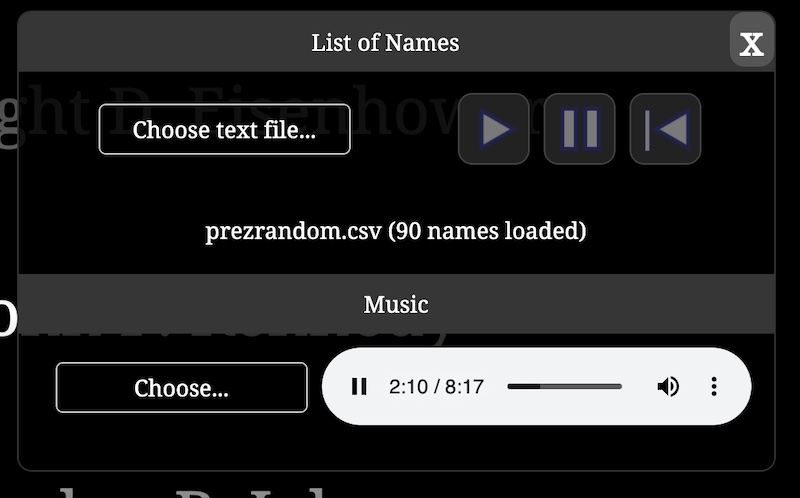
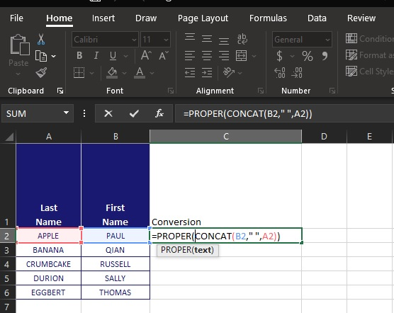
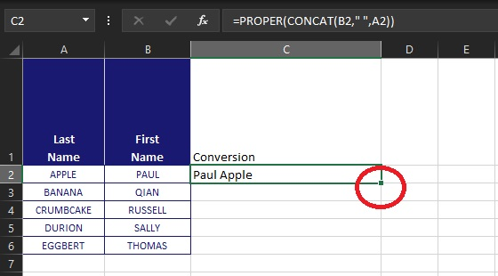
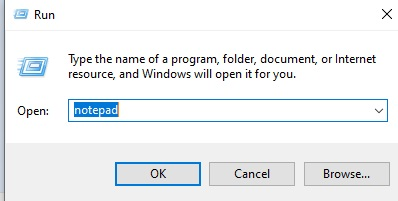
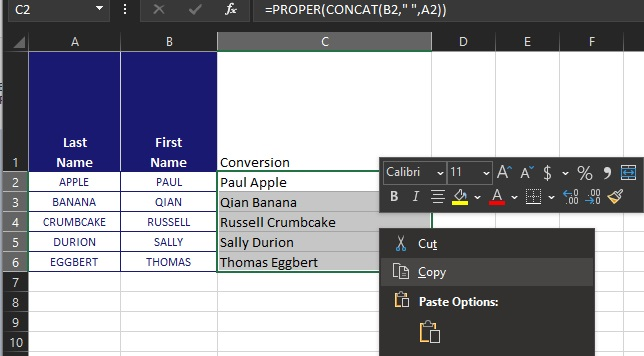
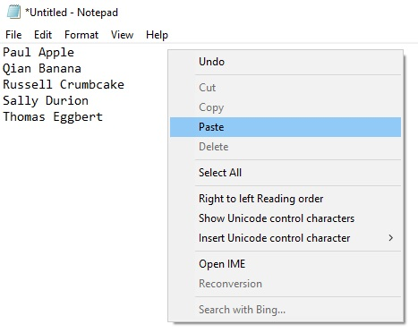

# In Memoriam Veterans Presentation
Dynamically generates a list of names that vertically scroll for use during a semi-annual memorial service. Also supports music playback. Try a [demo](https://gmarzloff.github.io/VA-memorial-scroller/memorial.html).


## Installation
1. Save the `VA-memorial-scroller` folder anywhere on your hard drive. It does not require a web server to run. 
1. Open `memorial.html` in Google Chrome. 
1. Click the bottom left gear icon to load the names list and music. The names list must be a text file, with one name per line. See below for converting excel sheet to a text file. A sample file `presidents.csv` is located in the  `names` folder. 

Example: 
```
George Washington
John Adams
Thomas Jefferson
James Madison
James Monroe
John Quincy Adams
```

4. The `.gitignore` file is ignoring anything in a `names/private/` folder, so if you plan on committing revisions to your own repository or contributing to the public one, store the PHI in the `private` folder. 
1. The scrolling will begin automatically. 

Use the play, pause, and restart buttons to control the scrolling list. 



## Music

6. Click the `Choose...` button to load a local file; audio filetypes compatible with HTML5's `audio` element are supported, including .mp3 and .wav. 
1. The file starts playing immediately. You can pause, seek, and change the volume to the track. The file will also loop automatically. 

A playlist of multiple files is not supported at this time.

## Scrolling speed
To change the scrolling speed, you must change the total duration of the scroll. Edit the first line in `style/style.css`. The default is 300 seconds (300s) which takes about 13 seconds for each name to cross if the list is ~100 names. Change the number to any duration in seconds, save this file, and refresh the page in the browser. 

```
/* CHANGE THE ANIMATION DURATION HERE */
:root { --animation-duration: 120s; }
```

## How to prepare a text file from Excel

If the list of names is spread over columns, you can process the text into a new column as follows. 

1. Make a new column and the use the formula `=PROPER(CONCAT(B2," ",A2))`. `CONCAT()` joins text and `PROPER()` capitalizes first letters and makes the rest lowercase.



2. Then extend the formula down the column by double-clicking the bottom-right corner or drag the corner to the final cell. 



3. Open notepad or other text editor. Quickest way is `Windows Key` + `R`, or click Start -> Run..., type `notepad` then enter. Copy the Excel column with the formatted names and paste it into notepad. 


 




4. Save the new file anywhere, though `names/private/` in the repository is a convenient path that is ignored from version control. 

### Credits
Developed by George Marzloff, MD. This web app is open source and may be freely used under the [MIT License](https://opensource.org/licenses/MIT). 